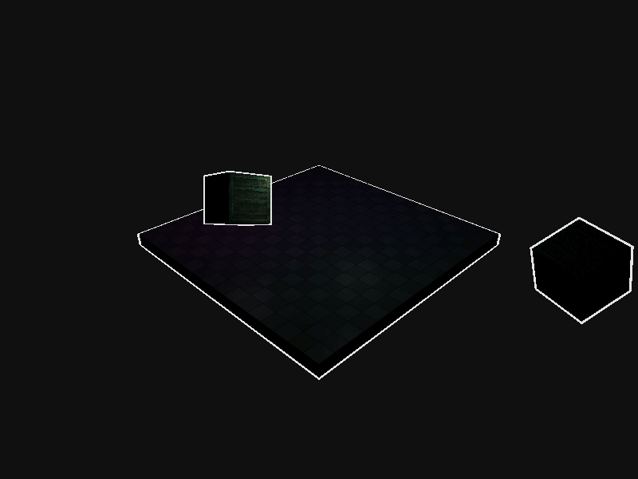
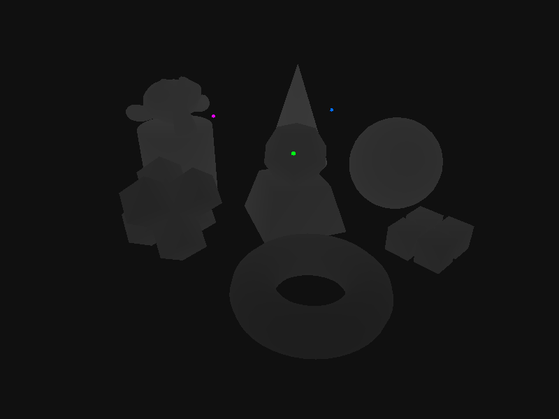
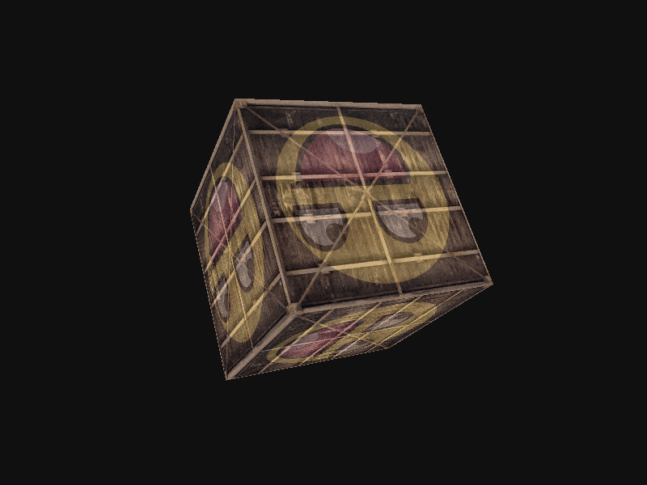

# Study-LearnOpenGL-cpp
Study project for learning OpenGL

| Project Started | Last Update | Version |
| :-------------- | :---------- | :-----: | 
| 19-Aug-2022     | 29-Jul-2023 | 0.47    |

# Table of Contents
1. [Description](#description)
2. [Installation and Usage](#installation-and-usage)
3. [Controls](#controls)
4. [Feature List](#feature-list)
5. [Display](#display)
6. [References](#references)

# Description
This is a study repository for learning graphics programming through OpenGL.

# Installation and Usage

# Controls
| Key          | Function |
| :------:     | :---------- | 
| `w`          | Move camera forward
| `a`          | Move camera to left
| `s`          | Move camera backwards
| `d`          | Move camera to right
| `x`          | Move camera down
| `space bar`  | Move camera up
| `q`          | Pitch towards left
| `e`          | Pitch towards right
| `r`          | Yaw towards up
| `f`          | Yaw towards down
| `z`          | Toggle mouse control on pitch and yaw (default: disabled) 
| `c`          | Reset camera position 
| `g`          | Toggle user interface 
| `shift`      | If pressed when moving speeds up the camera movement

# Feature List

# Display

```cpp
0.47 stencil testing - outline normalized (left: method 1, mid: method 2, right: method 2 without color)
// --------------------------------------------------
// Method 2.1: Normal extension with normalized thickness
// Problem 1: This approach solving the problem of method 1; scale of outlining is not based of origin but normal scaled a small amount and added to the position. However, the problem of this method is normals on the same position with different direction (hard edges) causing to split mesh face by face. It is causing a distortion and break on the corners.
// Problem 2: Altohugh the depth test is active, closer objects are not drawing their outlines. The reason for this problem is not yet identified.
float scale_factor = pow(outline_scale, 0.6f);
vec3 current_pos = in_pos + (in_norm * (base_outline_scale / scale_factor)); 
gl_Position = view_proj_matrix * world_matrix * vec4(current_pos, 1.0f);
```  


```cpp
0.47 stencil testing - outline normalized
// --------------------------------------------------
// Method 1.1: Scaling from position
// Problem: If the object origin is not centered or object is not uniform scaling will be distorted. Does not really work for complex models with multiple meshes since it is impossible to guarantee origin is centered to object.
float scale_factor = pow(outline_scale, 0.6f);
vec3 currentPos = in_pos * (1.0f + (base_outline_scale / scale_factor));
```  


```
0.46 Scaled depth testing
```  


```
0.46 Model import illuminated (diffuse, specular, emission)
```  


```
0.44 Multiple lights: 1 directional- 3 point- (rgb), 1 spot light
```  


```
0.42 Light casters respectively: directional-, point-, spot light
```  


```
0.41 Light map and emission
```  


```
0.39 Phong shading
```  


```
0.35 Static camera rotation with changing focus by time
```  


```
0.31 Perspective projection
```  


```
0.21 Pixel color interpolation
```  


# References
- Learning
    - Videos
        - [Sanderson, Grant. "Essense of Linear Algebra". _Uploaded by 3Blue1Brown, Youtube_. 2016.](https://www.youtube.com/watch?v=fNk_zzaMoSs&list=PLZHQObOWTQDPD3MizzM2xVFitgF8hE_ab)
        - [Gordan, Victor."Stencil Buffer & Outlining". _Uploaded by Victor Gordan, Youtube_. 2021.](https://www.youtube.com/watch?v=ngF9LWWxhd0)
        - [Will, Brian. "OpenGL - depth and stencil buffers". _Uploaded by Brian Will, Youtube_. 2019](https://youtu.be/wVcWOghETFw)
    - Websites
        - Joey de Vries [learnopengl.com](https://learnopengl.com)
        - Jordan Santell [jsantell.com/3d-projection](https://jsantell.com/3d-projection/)
    - Supervision / Support
        - Volkan Ilbeyli [github.com/vilbeyli](https://github.com/vilbeyli)
- Dependencies
    - Libraries
        - GLFW | GLFW is a lightweight utility library for use with OpenGL. [Download](https://www.glfw.org/download.html)
        - GLAD | OpenGL hardware adjustment library. [Download](https://glad.dav1d.de/)
        - Asset-Importer-Lib | Importing 3d file formats into a shader, in-memory imediate format [Download](http://assimp.org/)
        - Dear ImGui | C++ gui library [Download](https://github.com/ocornut/imgui/releases/tag/v1.89.5)
        - stb_image.h | Image file load library. [Downlaod](https://github.com/nothings/stb/blob/master/stb_image.h)
    - Environment Setup 
        - Visual Studio (Main IDE)
        - Visual Studio Code
        - RenderDoc (Frame Debugging)
        - CMake
- Data
    - Phong shading predefined materials
        - OpenGL/VRML Materials. [http://devernay.free.fr/cours/opengl/materials.html](http://devernay.free.fr/cours/opengl/materials.html)
    - Models
        - Backpack by Berk Gedik [https://sketchfab.com/3d-models/survival-guitar-backpack-799f8c4511f84fab8c3f12887f7e6b36](https://sketchfab.com/3d-models/survival-guitar-backpack-799f8c4511f84fab8c3f12887f7e6b36)
        - Lantern by Rajil Jose Macatangay (polyhaven) [https://polyhaven.com/a/Lantern_01](https://polyhaven.com/a/Lantern_01)
        - Suzanne by Blender [https://docs.blender.org/manual/en/latest/modeling/meshes/primitives.html](https://docs.blender.org/manual/en/latest/modeling/meshes/primitives.html)
        - Test Objects by Kutay Coskuner (inspired by Robin Seibold) 